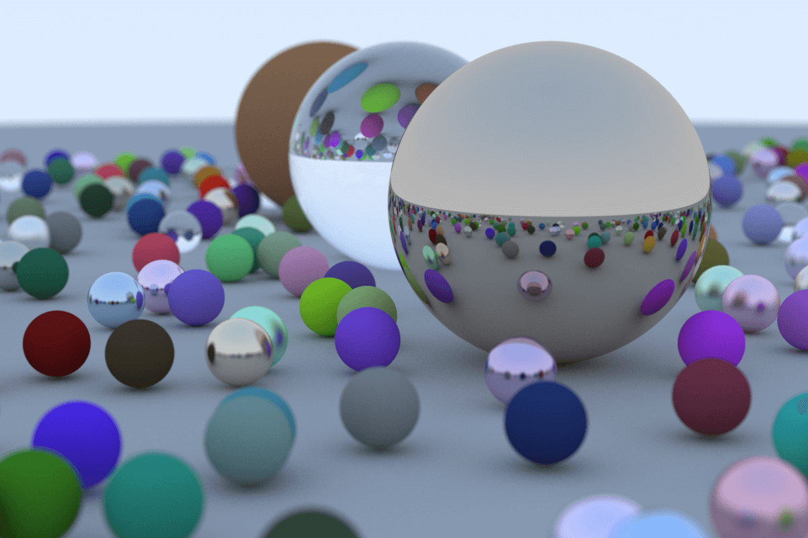

# Rayman

A ray tracer implemented in Rust, to learn the basics of Rust and computer graphics. Therefore the
source code is heavily commented, to help me understand the concepts and conventions of both. This
implementation is based on Peter Shirley's `Ray Tracing in One Weekend`.

## Generate image

1. [Install Rust tooling.](https://rust-lang.org/install.html)
2. Run `cargo run --release > image.ppm` inside the root directory.

## License

This project is [not licensed](https://choosealicense.com/no-permission/). Copyright (C) 2020 Robin
Dahlstedt.
